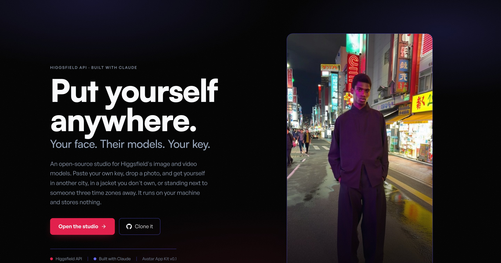

# Avatar App Kit



**Put yourself anywhere.** A local, open-source studio for the [Higgsfield API](https://docs.higgsfield.ai/docs) — drop a photo, get yourself in another city, in a jacket you don't own, or standing next to someone three time zones away.

You bring your own API key. Nothing is hardcoded, nothing is committed, and it runs on your machine — yours goes into an httpOnly cookie in your browser for 30 days, or into `.env.local` if you would rather not paste it on every fresh profile.

```bash
git clone https://github.com/Hainrixz/avater-appkit
cd avater-appkit
npm install
npm run dev
```

Open <http://localhost:3000>, paste your key from [cloud.higgsfield.ai](https://cloud.higgsfield.ai), and go. Checking the key costs nothing.

---

## What it does

First you pick what you want — **Photos** or **Video** — then a recipe:

| Recipe | You give it | You get |
|---|---|---|
| **Teleport** | one photo + a place ("Tokyo at night") | 1, 2 or 4 vertical stills of you there |
| **Try-on** | your photo + a garment photo | you wearing it |
| **Duo** | your photo + someone else's | the two of you in one frame |

Every verified video model needs an image to animate, so a video is always two calls
underneath. That is the app's problem, not yours: pick Video and it runs both stages
itself and shows the combined price first (`Generate video · N cr · $0.442`, broken out as
*photo $0.092 + video $0.350*). Pick Photos and you get stills you can download, with
the option to animate any one of them afterwards at the price shown next to the button.

Image models and video models are separate catalogues — the image ones cannot make
video and vice versa — so the pickers say which is which, and in Video mode they are
numbered as the two stages they are.

## Why bring your own key

No key ships in this repo. When you paste yours it goes into an httpOnly cookie for your browser and travels only to your own `localhost` server, which forwards it to Higgsfield. It is never in the client bundle, never in a commit, and never sent anywhere else. (Higgsfield's own docs forbid calling their API straight from browser code, which is why the proxy exists.)

That also means you can hand this repo to anyone. They bring their own key and spend their own credits.

## The parts worth stealing

This is a starter kit, so the interesting bits are the ones that took measurement rather than typing:

- **Model choice is not obvious, and the endpoint name will not tell you.** `soul/reference` reproduces the reference photo's *whole composition* — background included — so a portrait plus "Tokyo at night" returns the same portrait. Two prompt rewrites, with and without `enhance_prompt`, failed identically before that was clear. Teleport moved to `popcorn/auto`, which does compose a subject into a genuinely new scene. See **Known limitations** for where that still falls short.
- **There is an undocumented identity API, and it is not in the OpenAPI.** `POST /v1/custom-references` trains a reusable "Soul ID" from photos of one person, which `soul/character` then generates from. None of it is in `openapi.json`; it is in Higgsfield's own JS SDK and it answers live on `api.higgsfield.ai` with the same auth header. `GET /v1/text2image/soul-styles` (106 styles) is where valid `style_id` values come from, and `GET /v1/motions` (121 presets) is where DoP motion ids come from. Neither is wired up here yet: the two DoP entries in `lib/provider/higgsfield/models.ts` still omit `motions`, and the comment beside `dop-lite` still calls those ids undiscoverable. Wiring `motions` up is open work.
- **It probes what your key can actually run.** Model access is per-account: on the key this was built against, 11 of 15 catalogued models worked and the rest came back `404`, `423` or `503`, which the app files as `not_found`, `blocked` and `disabled`. So the app asks `/estimate` for each model at startup — that endpoint is free — and shows real prices next to real availability. Models you can't run stay visible, greyed out, with the reason.
- **It tells you what it changed.** Pick a 5-second clip, switch from Kling to Hailuo — which only does 6 and 10 — and the app snaps to 6 *and says so*: "Hailuo 2.3 doesn't do 5s clip length — using 6s." It also tells you that video takes its aspect ratio from the source still, because none of the verified video models accept an `aspect_ratio` field at all. Silent coercion is a bug from the user's seat.
- **The model switcher genuinely switches.** The API's request bodies are not uniform: `duration` is an integer `5|10` on Kling, `6|10` on Hailuo, and a *string* `"4"|"6"|"8"` on Veo; some models take `aspect_ratio` and `resolution`, others have no such field. Each catalogue entry owns a `buildBody()` that snaps unsupported values to the nearest legal one and drops fields the model doesn't have — and the UI tells you what it changed ("Hailuo doesn't do 5s clips — using 6s") instead of coercing silently. `npm run check:models` is the contract test for that.
- **Every generation shows its price first.** There is no balance endpoint, so an out-of-credits error is only discoverable at submit time. The free `/estimate` call is the only thing standing between you and a surprise.
- **Failures are honest.** `nsfw` is a distinct terminal state that Higgsfield refunds automatically, so it renders in neutral grey behind a shield rather than a red error: the headline is "This one didn't pass the safety filter", and the line under it opens with the credits that went back. Running out of concurrent slots arrives as a `400` (there is no `429` in this API), so it is matched by message rather than status and gets its own `concurrency_limit` kind instead of being filed as an invalid request — but the card still ends as a failure, in Higgsfield's own words, and you retry it yourself. Nothing re-queues a failed job for you: `USER_MESSAGES` in `lib/shared/errors.ts` has the friendlier copy for exactly this, and nothing imports it yet.
- **Results expire in about 7 days.** Every result carries an expiry badge and a download button that routes through `/api/download` — a cross-origin `<a download>` is ignored by every browser and would just open a tab.

## Known limitations

Written down because a starter kit that hides its gaps wastes your afternoon instead of mine.

- **Likeness is not solved yet.** Teleport runs on `popcorn/auto`, whose own catalogue calls it `text2image` and which exposes **no identity parameter of any kind**. It composes a convincing scene; it does not reliably give you *your* face. The fix is identified and not yet built: train a Soul ID through `POST /v1/custom-references`, then generate with `soul/character` and its `custom_reference_id` / `custom_reference_strength`. Until that lands, treat Teleport as "someone who looks a bit like you, somewhere else".
- **The demo images are a generated person, not a photograph of anyone.** They came from this app, but the face was synthesised first, so they do not demonstrate likeness preservation from a real selfie.
- **`enhance_prompt` defaults to true** on `soul/reference` and on both DoP models — not on the Soul family as a whole: `soul/standard` never sends the field, and neither does `popcorn/auto`, which is what all three recipes actually run on. Where it is on, Higgsfield rewrites your wording server-side before generating, so a result that ignores what you asked for is worth suspecting it. Where it is off, look elsewhere.
- **Veo 3.1 (reference), Veo 3.1, Sora 2 Pro and Seedance Pro Fast** are in the catalogue but were unavailable on the account this was built against — those four are the gap between the fifteen and the eleven above. They render greyed out with the reason and light up on their own if your plan includes them.
- **No webhooks.** `hf_webhook` needs a publicly reachable HTTPS endpoint, which localhost is not. Polling is client-driven on the documented backoff.

## Stack

Next.js 16 · React 19 · TypeScript · Tailwind v4 · shadcn/ui · zero API SDKs (a 200-line typed `fetch` client instead).

```
app/api/*        route handlers — the key never leaves the server
lib/provider/    the swappable seam: swap Higgsfield for another API here
lib/server/      what the route handlers stand on: the key's cookie, the API
                 guard, the URL allowlist, the availability cache, the upload
                 sniffer, the semaphore and the idempotency map
lib/shared/      the types and the error taxonomy both sides switch on
lib/client/      a 320-line store, a single-timer poller, and actions.ts (the
                 upload/submit logic, deliberately outside React; the price
                 estimate is asked for from the studio component too)
components/      hero, studio, upload, results
tests/models.ts  the buildBody contract test
```

### Swapping the API

`lib/provider/provider.ts` defines a small `Provider` interface — `listModels`, `getModel`, `uploadImage`, `estimate`, `submit`, `poll`, `cancel`, `probe`, `verifyCredentials`, none of them optional. `lib/provider/higgsfield/` implements it. To point this at a different generation API, write one more implementation and register it in `lib/provider/index.ts`. Everything above that seam — recipes, UI, polling, pricing display — is provider-agnostic.

## Four things that will bite you

All four cost real time or real money, so they're written down:

1. **A model that lists an image input does not necessarily preserve the person in it.** `popcorn/auto` takes reference images and has no identity parameter at all. Check what a model actually *does* before wiring a feature to it — the endpoint name will not tell you, and neither will its parameter list.
2. **Cloudflare blocks requests without a browser-like `User-Agent`.** Not documented anywhere. Every endpoint returns `403 error code: 1010` from a plain HTTP client, and the identical request with a UA header returns `200`. It looks exactly like a credentials problem and isn't. The header is set in `lib/provider/higgsfield/client.ts` — and in `app/api/download/route.ts`, which sends its own and is not browser-like, so a signed result URL that ever moves behind the same rule would fail there first.
3. **The published OpenAPI is wrong in places, and incomplete in whole families.** It declares `soul/standard` resolutions as `["2K","4K"]` while the live API demands `['720p','1080p']`. And `/files/generate-upload-url`, `/estimate/*`, `/v1/custom-references`, `/v1/text2image/soul-styles` and `/v1/motions` are not in it at all. Verify against the API and read the official SDK; do not generate a client from the spec and assume you have the surface.
4. **`setTimeout` takes a 32-bit long.** A sentinel of `Number.MAX_SAFE_INTEGER` used as "not due yet" reached it once and truncated to `-1`, firing immediately and spinning ~250 times a second for the life of the tab — and it was persisted, so it came back on every reload. If you use a far-future sentinel, never let it reach a timer.

## Scripts

```bash
npm run dev           # localhost:3000
npm run build         # production build
npm run typecheck     # tsc --noEmit
npm run lint          # eslint
npm run check:models  # the buildBody contract test — no network, no credits
npm run banner        # re-shoot .github/banner.jpg from the running app
                      # (needs `npx playwright install chromium` once)
```

## Making it yours

- **Colours and type** live in `app/globals.css`: the raw values in the `:root` block, the type scale and the Tailwind aliases in the `@theme inline` block above it. Change a value in `:root` and the app follows. Three things sit outside it — the literal `themeColor` in `app/layout.tsx`, because a meta tag cannot read a CSS variable, the indigo sweep in `components/results/GenerationProgress.tsx`, and the rose baked into `app/icon.svg`.
- **Recipes** are data, up to a point. `lib/recipes.ts` declares the slots, prompts and models, so swapping a model or rewriting a prompt touches nothing else. A third photo slot does touch something: `components/upload/SlotDropzone.tsx` lays `slots[0]` and `slots[1]` out by hand, so a third never gets a dropzone, never gets filled, and the generate button never unlocks. Give it a real `slots.map()` first.
- **Demo images** in `public/demo/` are real output from this app, not mockups. Swap them for your own and the hero and comparison slider update.
- **More components**: this uses [21st.dev](https://21st.dev). With your own key in `.env.local`, `npx shadcn@latest add "https://21st.dev/r/<author>/<slug>?api_key=$API_KEY_21ST"`.

## Licence

MIT — see [LICENSE](./LICENSE). The Satoshi and General Sans fonts in `app/fonts/` are under the ITF Free Font License; if you ship this commercially you inherit that, so keep [app/fonts/LICENSE.md](./app/fonts/LICENSE.md).

Not affiliated with Higgsfield. Built with [Claude Code](https://claude.com/claude-code).
